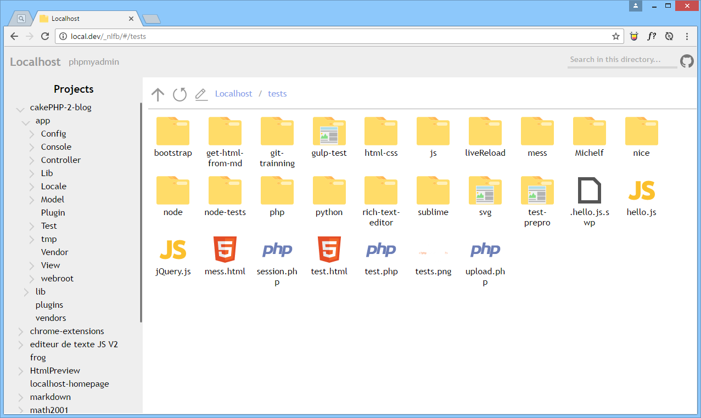
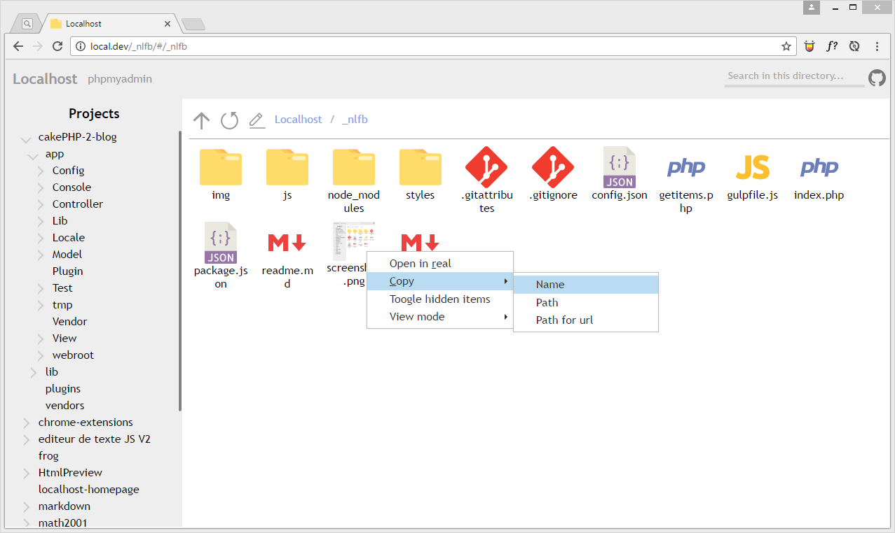
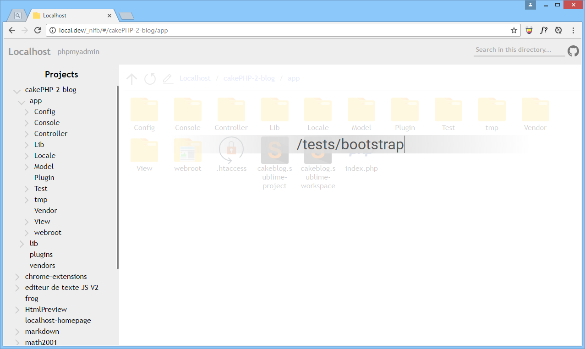
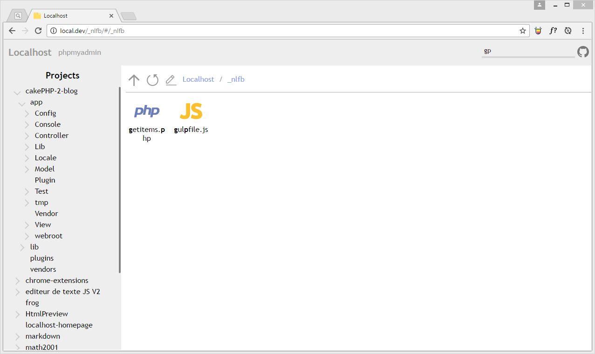
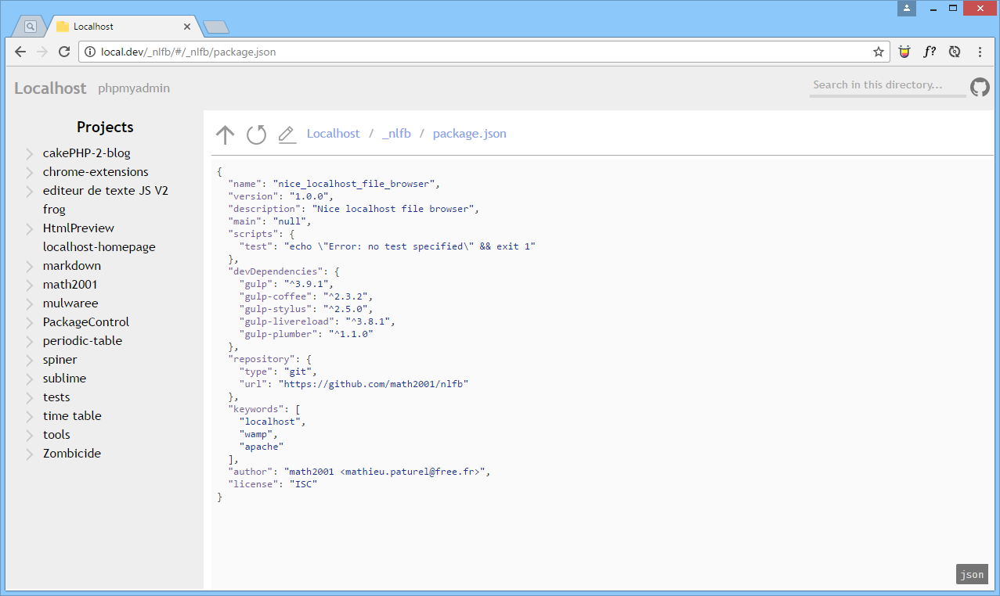

# NLFB - Nice Localhost File Browser

We have to admit, the homepage of WAMP is not super great, and the apache browser is quite ugly. **So, this repository is here to solve the problem!** Have a look!

Well, have you made your choice?

### Installation

This is really simple.

1. Open a terminal and go in the `www` directory. (for the lazy ones: `cd C:/wamp/www` :smile:)
2. Run `git clone "https://github.com/math2001/nlfb.git" "_nlfb"`
3. Open the `index.php` file in your favorite editor and paste this line at the very beginning: `<?php header('location: /_nlfb/'); ?>`

Done! Open [localhost](http://localhost) and [*savourez*](http://lmgtfy.com?q=what does mean savourez)!

### Usage

Go have a look [here](http://math2001.github.io/nlfb)

